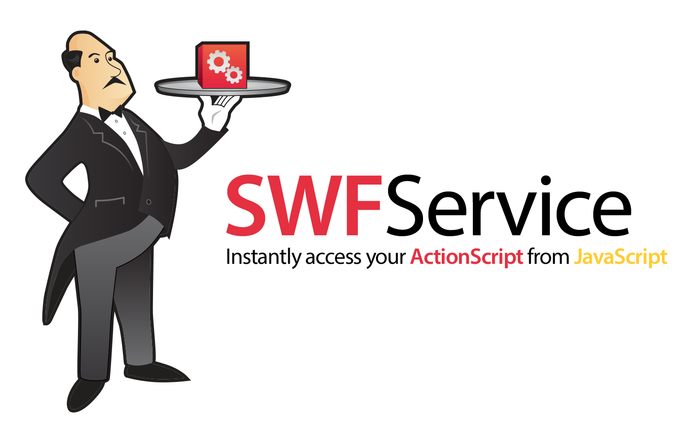

<div>
    <br><br>
    <!-- Embedded in a table as a workaround for the bullets losing their left padding. -->
	<table border="0">
		<tr style="border: none;">
			<td style="border: none;">
				<br>
				<br><br>
				<p>With SWFService and just a couple lines of code you can:</p>
				<ul>
					<li>call synchronous and asynchronous methods;</li>
					<li>get and set properties and accessors, and</li>
					<li>add and remove event listeners</li>
				</ul>
				<p>on an ActionScript class instance from JavaScript as if it were a native JavaScript object.</p>
				<br>
			</td>
		</tr>
	</table>
	<br><br>
</div>

## About

The Flash Platform's standard [ExternalInterface](http://help.adobe.com/en_US/FlashPlatform/reference/actionscript/3/flash/external/ExternalInterface.html) only provides a low level API for communicating across the boundary between ActionScript and JavaScript.  Exposing a typical API using ExternalInterface requires a significant amount of boilerplate code.  Further, ExternalInterface does not provide primitives for supporting more advanced features, such as event dispatching or asynchronous methods calls.

SWFService builds on ExternalInterface to provide a generalized solution for automatically exposing AS3 class instances as named "services" which provide an RPC-style API to JavaScript.  An AS3 class instance can be registered with SWFService with a single line of code.  

Once an AS3 class instance is registered as a "service", a JavaScript developer can use SWFService to obtain a dynamically generated proxy object that allows him/her to interact with that "service" to:

* call synchronous and asynchronous methods,
* get and set properties and accessors, and
* add and remove event listeners

as if it were a native JavaScript object.

## Usage

Imagine that you wanted to expose to JavaScript the following AS3 API for controlling a video player in your SWF:

```actionscript
package videoplayer		
{
	import videoplayer.events.VideoPlayerServiceEvent;
	
	import mx.rpc.AsyncToken;

	[Event(name="play", type="videoplayer.events.VideoPlayerServiceEvent")]
	[Event(name="stop", type="videoplayer.events.VideoPlayerServiceEvent")]
	
	public class VideoPlayerService
	{
		public var apiKey:String = null;
	
		public function get isPlaying():Number
		{
			...
		}
		
		public function load( videoId:String, suggestedQuality:String = null ):AsyncToken
		{
			...
		}
		
		public function play():void
		{
			...
			
			dispatch( new VideoPlayerServiceEvent( VideoPlayerServiceEvent.PLAY, metadata ) );
		}
		
		public function stop():void
		{
			...
			
			dispatch( new VideoPlayerServiceEvent( VideoPlayerServiceEvent.STOP, metadata ) );
		}
		
		public function getAvailablePlaybackRates():Array
		{
			...
		}
		
		public function setPlaybackRate( suggestedRate:Number ):void
		{
			...
		}
		
		...
	}
}
```

### Adding SWFService to your Flex or AS3 Project

Reference `SWFService.SWC` or its individual AS3 source files in your project.

### Registering an AS3 class instance as a SWF Service

In your SWF's startup logic you would simply register an instance of this AS3 class with SWFService, specifying an arbitrary identifier of your choice:

```actionscript	
import com.codecatalyst.swfservice.SWFService;
...

SWFService.register( "VideoPlayerService", new VideoPlayerService() );
```

This will make the registered AS3 class instance available as a "service" that can be requested and interacted with from JavaScript.

### Including SWFService in your HTML Page

Reference the script file from your HTML file:

```html
<script src="SWFService.js"></script>
```

or, for the minified version of the script:

```html
<script src="SWFService.min.js"></script>
```

### Obtaining a JavaScript reference to a SWF Service

From JavaScript, you can request an AS3 class instance from SWFService, by calling `SWFService.get()` and specifying the SWF tag id and the identifier that was used to register that AS3 class instance as a service.  `SWFService.get()` returns a [JavaScript Promise](http://github.com/CodeCatalyst/promise-coffee) that will resolve with a JavaScript proxy object when the requested service becomes available (i.e. when the SWF is loaded and that service has been registered).  This proxy object is automatically populated with all of the public properties, accessors and methods your AS3 class instance exposed.

For example:

```javascript
SWFService
	.get( 'MySWF', 'VideoPlayerService' )
	.then( 
		function ( videoPlayerService )
			console.log( videoPlayerService );
		),
		function ( error ) {
			console.error( error.message );
		}
	);
```

where `MySWF` is the id for the SWF &lt;object&gt; tag in your HTML page, `VideoPlayerService` is the identifier used to register the service in the SWF.  You can optionally specify a timeout in milliseconds for acquiring the service as the third parameter.

### Methods

Using that service proxy object, you can call methods:

```javascript
videoPlayerService.play();
```

Those methods can return values, which will automatically be converted to corresponding their JavaScript data types (see the documentation for [ExternalInterface](http://help.adobe.com/en_US/FlashPlatform/reference/actionscript/3/flash/external/ExternalInterface.html) for more details on type conversion).

```javascript
var playbackRates = videoPlayerService.getAvailablePlaybackRates();
```

If your method is asynchronous and returns an [AsyncToken](http://help.adobe.com/en_US/FlashPlatform/reference/actionscript/3/mx/rpc/AsyncToken.html) or [Promise](http://github.com/CodeCatalyst/promise-as3), the return value will automatically be converted into a [Promises/A+](https://github.com/promises-aplus/promises-spec) compliant [JavaScript Promise](http://github.com/CodeCatalyst/promise-coffee):

```javascript
videoPlayerService.load( videoId ).then(
	function ( result ) {
		console.log( 'Load succeeded:', result );
	},
	function ( error ) {
		console.error( 'Load failed:', error.message );
	}
);
```

### Properties and Accessors

You can also get or set property values directly on the service proxy object:

```javascript
videoPlayerService.apiKey = "7f88e7fe-4757-4a4b-9a0f-2a7630c48b12";

console.log( videoPlayerService.apiKey );
```

Or call getter or setter accessors as if they were properties:

```javascript
console.log( videoPlayerService.isPlaying );
```

### Events

Additionally, you can add or remove event listeners:

```javascript
var onVideoPlayerEvent = function ( event ) {
	console.log( "Video player event:", event.type, event.metadata );
};

videoPlayerService.addEventListener( "play", onVideoPlayerEvent );
videoPlayerService.addEventListener( "stop", onVideoPlayerEvent );

videoPlayerService.removeEventListener( "play", onVideoPlayerEvent );
videoPlayerService.removeEventListener( "stop", onVideoPlayerEvent );
```

(The method signatures for adding and removing listeners match those in `flash.events.EventDispatcher`, so you can optionally specify `useCapture` and `priority` parameter values when adding your listener.)

## Building SWFService

SWFService includes distributable builds of both the client and service portions of the library, which can be found here:

	/dist/

The source code for the JavaScript client portion of SWFService can be found here:

	/src/client/SWFService	

It is written in [CoffeeScript](http://coffeescript.org/).

The source code and Flash Builder proejct for the ActionScript service portion of SWFService can be found here:

	/src/service/SWFService

Both the client and service projects provide their own ant `build.xml` build scripts.

At the root of the project there is a master ant `build.xml` build script that will execute the build scripts for both the client and service projects and package up a distributable `.zip` of the final builds for both projects and the generated ASDocs documentation.

## Acknowledgements

* [Jason Barry](http://dribbble.com/artifactdesign), who designed the SWFService butler mascot.

## License

Copyright (c) 2008-2013 [CodeCatalyst, LLC](http://www.codecatalyst.com/)

Permission is hereby granted, free of charge, to any person obtaining a copy of this software and associated documentation files (the "Software"), to deal in the Software without restriction, including without limitation the rights to use, copy, modify, merge, publish, distribute, sublicense, and/or sell copies of the Software, and to permit persons to whom the Software is furnished to do so, subject to the following conditions:

The above copyright notice and this permission notice shall be included in all copies or substantial portions of the Software.

THE SOFTWARE IS PROVIDED "AS IS", WITHOUT WARRANTY OF ANY KIND, EXPRESS OR IMPLIED, INCLUDING BUT NOT LIMITED TO THE WARRANTIES OF MERCHANTABILITY, FITNESS FOR A PARTICULAR PURPOSE AND NONINFRINGEMENT. IN NO EVENT SHALL THE AUTHORS OR COPYRIGHT HOLDERS BE LIABLE FOR ANY CLAIM, DAMAGES OR OTHER LIABILITY, WHETHER IN AN ACTION OF CONTRACT, TORT OR OTHERWISE, ARISING FROM, OUT OF OR IN CONNECTION WITH THE SOFTWARE OR THE USE OR OTHER DEALINGS IN THE SOFTWARE.
